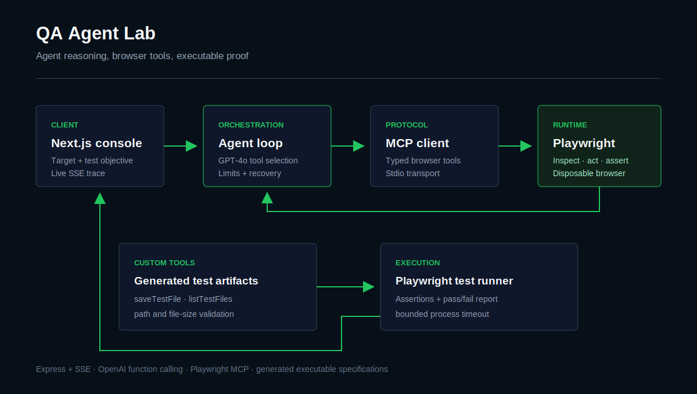

<!-- markdownlint-disable MD001 MD013 MD033 MD041 -->
<div align="center">

# QA Agent Lab

### An MCP-powered agent that explores web applications and writes executable tests

[Live controlled demo](https://qa-agent-lab-iota.vercel.app) ·
[Portfolio](https://relinxx.vercel.app/projects/qa-application) ·
[Setup guide](SETUP.md)


</div>

QA Agent Lab is an autonomous quality-assurance system that turns a target application into an inspected, exercised, and documented test surface. The agent uses GPT-4o to choose browser tools exposed through the Model Context Protocol, discovers critical user flows, writes Playwright specifications, executes them, and streams progress to the frontend.

The [public demo](https://qa-agent-lab-iota.vercel.app) runs the same core idea inside fixed sandbox applications and disposable Chromium sessions, making the workflow safe to evaluate without granting arbitrary browser access.

## What the agent does

1. Accepts a target URL and optional OpenAPI context.
2. Starts a Playwright MCP session.
3. Inspects pages and interactive elements.
4. Chooses navigation, input, click, and assertion actions.
5. Writes timestamped Playwright test files.
6. Executes generated tests and reports the result.
7. Streams tool activity and progress to the UI through SSE.

## Architecture



The system separates reasoning, browser control, and file execution:

- **Agent loop:** manages model messages, tool calls, iteration limits, and recovery.
- **MCP layer:** exposes browser actions through the Playwright MCP server.
- **Custom tools:** save generated tests, execute Playwright, and list artifacts.
- **Safety controls:** validate URLs and file paths, cap output sizes, time out tools, and prune message history.
- **Delivery layer:** Express streams progress while the Next.js client renders the live run.

## Engineering highlights

| Area | Implementation |
| --- | --- |
| Tool orchestration | MCP client over a Playwright stdio transport |
| Reasoning | GPT-4o function calling with bounded iterations |
| Browser automation | Navigation, snapshots, form input, clicks, and assertions |
| Test generation | Playwright `.spec.ts` / `.spec.js` artifacts |
| Live feedback | Server-Sent Events |
| Reliability | Tool timeouts, reconnect attempts, rate limiting, and history pruning |
| File safety | Extension allowlist, size cap, and directory-traversal protection |

## Safety model

Autonomous browser agents need explicit boundaries. This codebase includes:

- URL format validation before starting a run
- Sanitized test-file paths constrained to `server/tests`
- A 1 MB generated-file limit
- A five-minute test execution timeout
- A 60-second individual tool timeout
- Bounded model iterations
- Truncated browser snapshots to control context growth
- MCP reconnection handling for interrupted sessions

The hosted demo narrows this further by allowing only its own `/sandbox/` routes and using disposable browser sessions.

## Repository structure

```text
.
|-- client/                    # Next.js run console
|   `-- src/
|-- server/
|   |-- src/
|   |   |-- agent.ts          # GPT-4o + MCP agent loop
|   |   |-- tools.ts          # Test artifact and execution tools
|   |   |-- rateLimiter.ts    # Request/token pacing
|   |   `-- index.ts          # Express and SSE delivery
|   `-- tests/                 # Generated Playwright tests
|-- docs/architecture.svg
|-- CRAWLER_AGENT_DOCUMENTATION.md
|-- SETUP.md
`-- README.md
```

## Run locally

Requirements: Node.js 18+, npm, an OpenAI API key, and Playwright browser dependencies.

```powershell
cd server
npm install
npx playwright install
Copy-Item .env.example .env
```

Configure:

```env
OPENAI_API_KEY=your_key
OPENAI_MODEL=gpt-4o
PORT=3001
MAX_ITERATIONS=50
```

Start the backend:

```powershell
cd server
npm run dev
```

Start the frontend in another terminal:

```powershell
cd client
npm install
npm run dev
```

Open `http://localhost:3000`.

## Build checks

```powershell
cd server
npm run build

cd ..\client
npm run build
```

## Scope

This is an applied-agent engineering project: the difficult part is not generating test text, but maintaining a reliable loop across model decisions, browser state, tool failures, generated files, test execution, and a live user-facing trace.

## Author

Built by [Syed Muhammad Rehan](https://www.linkedin.com/in/relinxx), an AI-focused software engineer interested in agent reliability, browser automation, RAG, and production backend systems.
